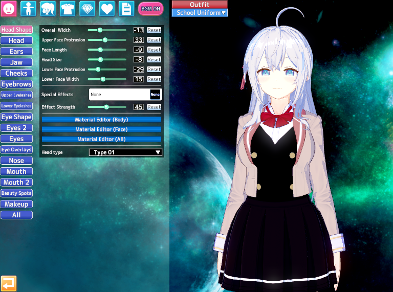
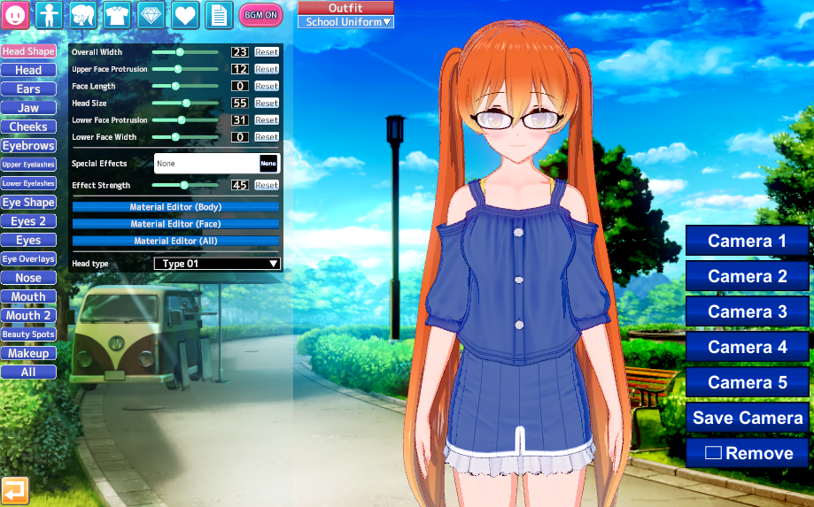

# 🧝🏻‍♀️ AniCard

Backend для хранения и обмена карточек персонажей Emotion Creators.

Проект разрабатывается для развития навыков backend-разработки и демонстрации контекста знаний для работодателей.

## 📬 Контакты

## 📖 Содержание

- [Что это за проект](#что-это-за-проект)
- [Стек технологий](#стек-технологий)
- [Функционал, что можно делать](#функционал-что-можно-делать)
- [Как запустить](#как-запустить)
- [Применение ИИ в разработке](#применение-ии-в-разработке)

## Что это за проект

**AniCard** - это backend система сайта, предназначенного для хранения карточек Emotion Creators.

**Emotion Creators** - это программа для создания аниме персонажей.

В **Emotion Creators** можно создавать PNG-файлы, включающие в себя метаданные внешности персонажа, которыми можно делиться с другими пользователями редактора.

<table>
  <!-- Первый ряд: изображения (2,3,4) – серая линия снизу -->
  <tr style="border-bottom: 1px solid gray;">
    <td align="center"></td>
    <td align="center"></td>
    <td align="center"></td>
  </tr>
  <!-- Второй ряд: имена (Alya, Sakura, Asuna) – чёрная линия снизу -->
  <tr style="border-bottom: 1px solid black;">
    <td align="center"><strong>Alya</strong></td>
    <td align="center"><strong>Sakura</strong></td>
    <td align="center"><strong>Asuna</strong></td>
  </tr>
  <!-- Третий ряд: следующие изображения (5,6,7) -->
  <tr>
    <td align="center"></td>
    <td align="center"></td>
    <td align="center"></td>
  </tr>
  <!-- Четвёртый ряд: следующие имена (Gremory, Zero Two, Nezuko) -->
  <tr>
    <td align="center"><strong>Gremory</strong></td>
    <td align="center"><strong>Zero Two</strong></td>
    <td align="center"><strong>Nezuko Kamado</strong></td>
  </tr>
</table>

Проект находится в процессе активной разработки.

## Стек технологий

**Языки**  

**Backend**  

**Тестирование**  

**База данных**  

**Инфраструктура**  

## Функционал, что можно делать
- Регистрироваться и входить (получать JWT-токен)
- Загружать карточки персонажей
- Искать персонажей по параметрам
- Скачивать карточки персонажей
- Удалять карточки персонажей
- Обновлять информацию по карточкам персонажей

## Как запустить
Нужны Git и Docker на компьютере.

Открыть терминал, перейти в нужную директорию.

Ввести команды (Linux, WSL):
- `git clone https://github.com/Lord-Velion/anicard.git`
- `docker-compose -f compose.dev.yml up --build`

Дождаться запуска контейнеров.

В браузере ввести: `http://localhost:8080/swagger`

## Применение ИИ в проекте

Работа на данный момент идёт по принципу:
- 60% - Google + Gemini
- 25% - DeepSeek + ChatGPT
- 15% - Opencode

Строится понимание пользы ИИ-систем и границ их возможностей.

